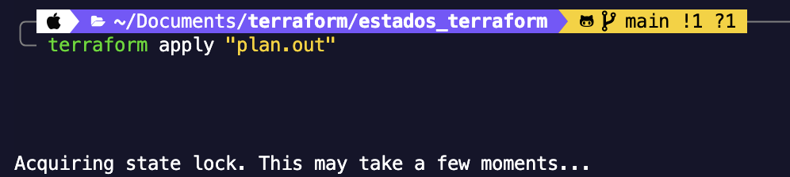

# Gestión de Infraestructura con Terraform

> Guía de referencia rápida para instalar, configurar y operar Terraform

---

## Instalación

**macOS**
```bash
brew tap hashicorp/tap
brew install hashicorp/tap/terraform
```

**Otros sistemas operativos**
Descarga el instalador oficial según tu SO: [Guía de instalación oficial](https://developer.hashicorp.com/terraform/install)

---

## Proveedor de nube

Terraform se conecta a distintos servicios de nube (Azure, AWS, GCP, etc.) a través de **proveedores**. Cada proveedor expone los recursos que puedes crear y gestionar.

→ [Ver todos los proveedores disponibles](https://registry.terraform.io/browse/providers)

---

## Configurar un proveedor — Ejemplo: Azure

**1. Crea un archivo `main.tf`** en tu proyecto y agrega el siguiente bloque:

```hcl
terraform {
  required_providers {
    azurerm = {
      source  = "hashicorp/azurerm"
      version = "4.69.0"
    }
  }
}

provider "azurerm" {
  features {} # Requerido para el funcionamiento de azurerm
}
```

**2. Descarga el proveedor** ejecutando:

```bash
terraform init
```

---

## Flujo de trabajo principal de Manejo de Infra

### 1. Inicializar el proyecto

Prepara el directorio de trabajo: descarga los proveedores y módulos necesarios. Ejecuta esto una sola vez al comenzar o al añadir nuevos proveedores.

```bash
terraform init
```

### 2. Planificar los cambios

Compara el estado actual de tu infraestructura con lo definido en tus archivos y guarda las acciones pendientes en `plan.out`. Revisa el resultado antes de aplicar.

```bash
terraform plan -out plan.out
```

### 3. Aplicar los cambios

Ejecuta el plan guardado y crea o modifica los recursos en tu proveedor de nube.

```bash
terraform apply "plan.out"
```

---

## Eliminar infraestructura

> ⚠️ **Acción irreversible.** Asegúrate de revisar qué recursos serán eliminados antes de confirmar.

### Destruir todo

Elimina permanentemente todos los recursos administrados por los archivos de configuración actuales.

```bash
terraform destroy
```

### Destruir un recurso específico

Elimina solo un recurso sin afectar el resto. Reemplaza `<nombre>` con el nombre que le diste al recurso en tu configuración.

```bash
terraform destroy -target=azurerm_resource_group.<nombre>
```
### Agregar un nuevo proveedor

Para añadir a un nuevo proveedor se necesitará reiniciar el proyecto

```bash
terraform init -upgrade
```

### Prácticas de seguridad

Al momento de desplegar nuestra infraestructura , se genera un archivo "terraform.tfstate", este mismo traerá toda la bitácora/estado relacionada a lo desplegado, por lo cual lo mejor será mantenerlo oculto por temas de seguridad y no subirlo a nuestros repositorios.

"terraform.tfstate" le permite saber al motor de Terraform qué esta echo, últimos cambios, cadenas de conexión y llaves de acceso expuestas.


### Estado remoto

Al trabajar en equipo, es crítico que el archivo de estado (terraform.tfstate) sea la única fuente de verdad para evitar discrepancias en la infraestructura. Para lograrlo, el manejo del estado debe configurarse de forma remota a través del bloque backend. Es importante destacar que cada proveedor de nube maneja de manera distinta el lugar de almacenamiento para poder bloquear el estado. Una vez configurado el backend correspondiente a la nube (GCP, AWS o Azure), se habilita el bloqueo de estado (state locking): cada vez que alguien inicia un despliegue, el estado se bloquea temporalmente para evitar modificaciones simultáneas. Al finalizar, el archivo se libera, permitiendo que otros miembros del equipo puedan consultar la versión más reciente y realizar nuevos cambios.

Al momento de manejar el estado de manera remota, ya no lo podrás visualizar de manera local, sin embargo una forma de consultarlo es:

```bash
terraform show
```




### Tutoriales por tipo de Proveedor de nube

[Documentación](https://developer.hashicorp.com/terraform/tutorials)
